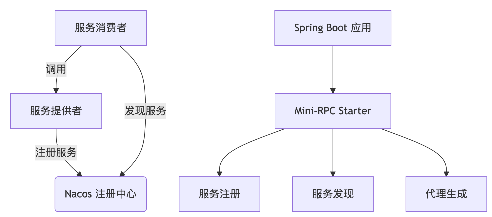

# Mini-RPC Framework

[](https://opensource.org/licenses/Apache-2.0)
[](https://www.oracle.com/java/)
[](https://vertx.io/)

基于 Vert.x 的高性能 RPC 框架，深度整合 Spring Boot 生态，提供企业级分布式服务调用解决方案。

## 核心架构

```mermaid




graph TD
    A[服务提供者] -->|注册服务| B(Nacos 注册中心)
    C[服务消费者] -->|发现服务| B
    C -->|调用| A
    D[Spring Boot 应用] --> E[Mini-RPC Starter]
    E --> F[服务注册]
    E --> G[服务发现]
    E --> H[代理生成]


Copyright 2025 Bling Team
