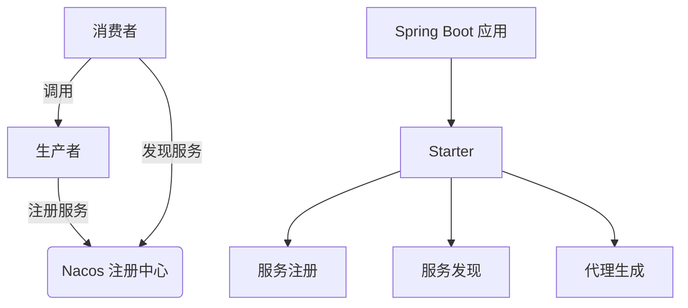

# Mini-RPC Framework

基于 Vert.x 的轻量级高性能 RPC 框架，深度整合 Spring Boot 生态，提供轻量级分布式服务调用的组件

## 📌 项目特点
- **高性能通信**：基于 Vert.x 的异步网络框架处理高并发请求
- **服务管理**：集成 Nacos 实现服务注册与发现
- **无侵入设计**：通过注解实现服务暴露与调用
- **配置灵活**：通过 YAML 配置文件动态调整参数
- **负载均衡**：内置随机算法
- **双模连接**：支持注册中心与直连两种服务发现模式

## 📐 核心架构

## 🏗️ 技术栈

| 组件 | 版本 | 功能 |
|------|------|------|
|  **Vert.x** | `4.5.1` | 异步网络框架 |
|  **Nacos** | `1.4.6` | 服务注册与发现 |
|  **Spring Boot** | `2.7.x` | 依赖注入与配置管理 |
